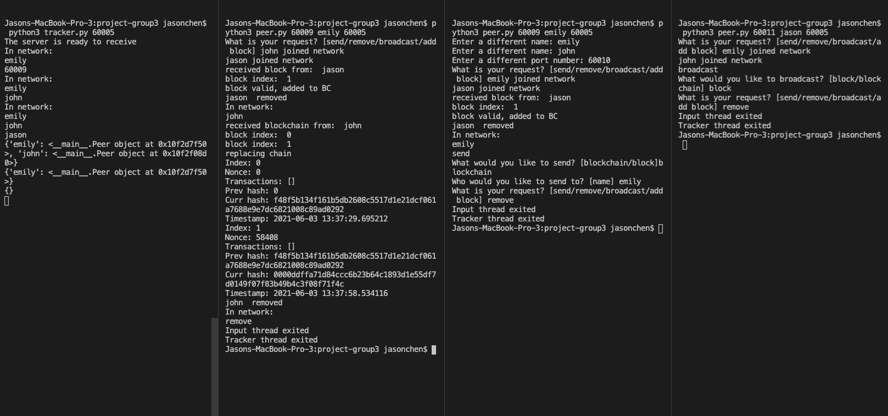
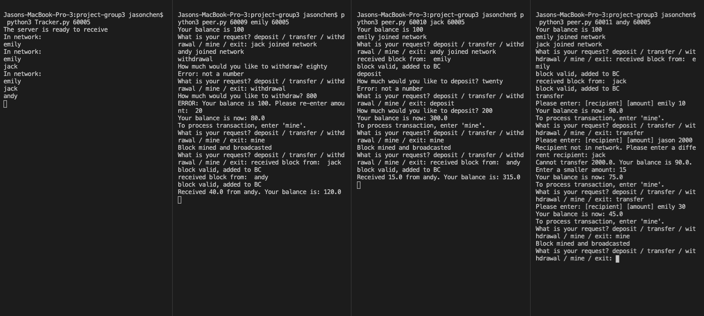

<h1> 

# TESTING.md
**CS60, 21S
Final Project
Peer-to-Peer Blockchain with Crypto Wallet Application**


**Group 3 - Error 404
Jason Chen, Grace King, Norman Kuang, Rehoboth Okorie**

## Introduction

Testing was performed separately for each module of the system: the blockchain API, the P2P network, and the Wallet GUI application layer. By testing each system component individually, we can detect and fix issues specific to that block. This also saves time on debugging, as systemic bugs during integration are much harder to detect and troubleshoot.

## Blockchain API

Unit tests were written in the following files to verify the functionality of the blockchain:

- `test_block.py`
- `test_blockchain.py`
- `test_transaction.py`

These unit tests can be run by typing in the following command:

```$: python -m unittest [unit-test-file-name] OR python -m unittest -v [unit-test-file-name] (for verbose)```

The bulk of the testing is performed on the Blockchain class, mostly verifying that we can successfully mine a block (compute the right nonce for the corresponding difficulty), add it to the blockchain, detect corruption, and fix the blockchain by recomputing the entire chain if needed. Looking at some example outputs (`script.py`) after making transactions on the first block and mining 3 more, we can see that the nonce is successfully generated with the right hash and the corresponding transactions:

```
======================================================================
Test Run at:  2021-06-03 13:59:54.937223
======================================================================
-----BLOCK 0-----
Index: 0
Nonce: 0
Transactions: []
Prev hash: 0
Curr hash: f48f5b134f161b5db2608c5517d1e21dcf061a7688e9e7dc6821008c89ad0292
Timestamp: 2021-06-03 13:59:54.938224
-----BLOCK 1 MINED-----
Index: 1
Nonce: 13462
Transactions:
        Sender:Roxanne
        Receiver:Willy
        Amt:5
        Sender:Brian
        Receiver:Margyu
        Amt:15
Prev hash: f48f5b134f161b5db2608c5517d1e21dcf061a7688e9e7dc6821008c89ad0292
Curr hash: 00009d31bc17912789cd9e4d94086202541e476e5cd147ff2e2a05aabc11be56
Timestamp: 2021-06-03 13:59:54.939225
-----BLOCK 2 MINED-----
Index: 2
Nonce: 24452
Transactions: []
Prev hash: 00009d31bc17912789cd9e4d94086202541e476e5cd147ff2e2a05aabc11be56
Curr hash: 00007eb11f756e21f59cfda6bfba8845845c20956a540aea2a4a9d529359f7b6
Timestamp: 2021-06-03 13:59:55.003283
-----BLOCK 3 MINED-----
Index: 3
Nonce: 121754
Transactions: []
Prev hash: 00007eb11f756e21f59cfda6bfba8845845c20956a540aea2a4a9d529359f7b6
Curr hash: 000074a58d4660692577b14783eaa4be02de55bfcd8b1b3c848e043db5438f3e
Timestamp: 2021-06-03 13:59:55.084357
-----BLOCK 4 MINED-----
Index: 4
Nonce: 101443
Transactions: []
Prev hash: 000074a58d4660692577b14783eaa4be02de55bfcd8b1b3c848e043db5438f3e
Curr hash: 0000d10673952ab95e500049ee50c13cf89a85af991a7c2ecae811ed4386c2ab
Timestamp: 2021-06-03 13:59:55.474216
```

Additional tests in `test_blockchain.py` verify that in the event that the blockchain gets corrupted i.e. index/nonce/transactions get modified, we can still detect it and recompute the chain starting at the corrupted block's index.

## Blockchain Corruption

Tested corruption of blockchain. If a block received from another Peer is invalid, the peer replace its own blockchain with the blockchain from the most number of peers.

Execution of testing:

- Peers A, B, and C join
- Peer A: add block
- Peer A: add block
- Peer A: broadcast blockchain
- Peer A: add block
- Peer A: corrupt block
- Peer B: add block
- Peer B: broadcast last block

Result: 

Peer A's cannot add the block from Peer B. It's last block is corrupted, so Peer A's blockchain will be replaced with either Peer B's or C's
Peer C's can successfully add the block from peer B because none of its blocks were corrupted.

#### Output

Please see terminal output of Peers A, B, and C pasted in corruption.txt under "test_outputs" folder:


## P2P

### Successful joining

- Tested non-unique name. Program will ask for a different name
- Tested non-numeric port. Program will ask for a number
- Tested a used port number (taken by another peer). Program will ask for a different port number
- Tested tracker adding a peer to its system
- Tested existing peers adding new peer to its network
- Tested new peer adding existing peers to its network


### Sending of data

- Tested sending block & blockchain to peers
- Tested broadcasting block & blockchain to peers

### Removal of peer

- Tested peer leaving and program quitting cleanly
- Tested other peer removing a peer from its network
- Tested tracker removing a peer from its system


### Example output

Please see p2p_testing.png in images folder

Brief explanation: 

First terminal from left is the tracker

In second terminal, emily joins and receives block from jason and blockchain from john, then leaves the network

In third terminal from left, emily requests to join, but name and port numbers are taken. Name is switched to john and port number is re-entered as 60010. John receives a block from jason, then sends a blockchain to emily and leaves the network.

In fourth terminal from left, jason joins the network and broadcasts a block to its peers before leaving.




## Wallet Testing

- Tested invalid request
- Tested invalid deposit amount (non-number)
- Tested invalid withdrawal amount (non-number, negative amt, amt greater than balance)
- Tested invalid transfer amount (non-number, negative amt, amt greater than balance)
- Tested computation of balance
- Tested invalid recipient for transfer of money
- Testing mining of block
- Bonus: Tested multiple transactions in a block


Example output below. Note: Terminal 2 from left focuses on withdrawal testing. Terminal 3 from left focuses on deposit testing. Terminal 4 from left focuses on transfer of money testing.



## Wallet GUI App

To the team: Showing that buttons work and is hooked up would probably be sufficient e.g. live demo/video.
